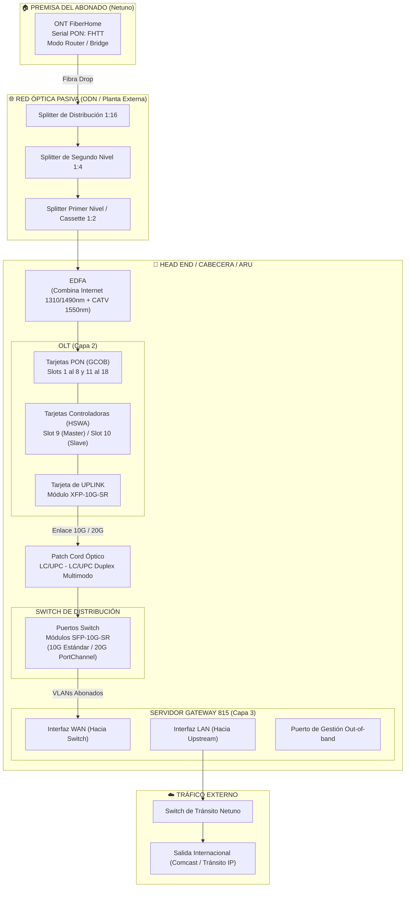
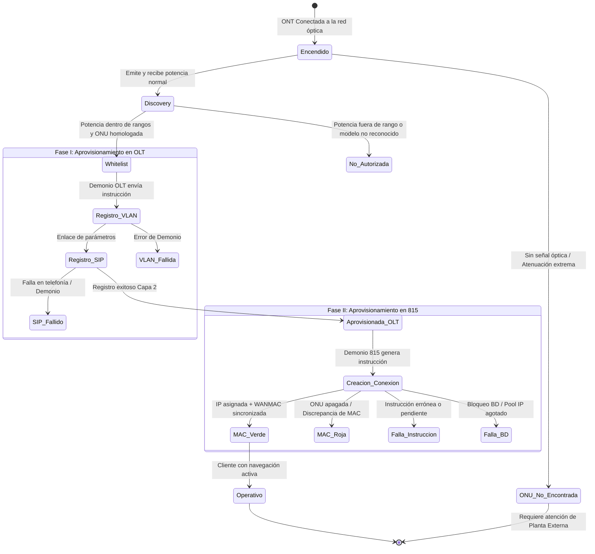
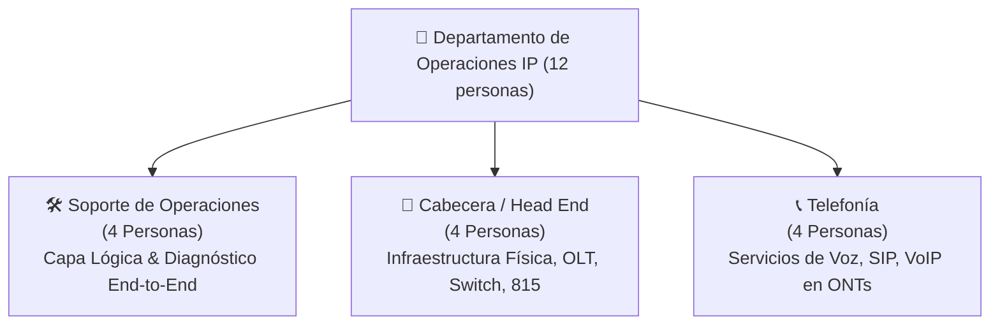
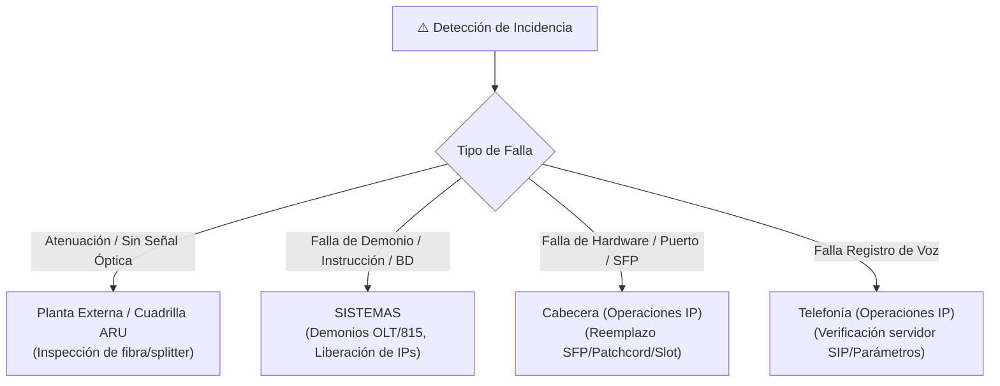

# LEVANTAMIENTO TÉCNICO Y OPERACIONAL: RED FTTH & OPERACIONES IP

---

## 📑 Tabla de Contenido
1. [Introducción y Alcance](#1-introducción-y-alcance)
2. [Análisis de la Documentación Base](#2-análisis-de-la-documentación-base)
3. [Flujo Físico y Óptico de Datos (ONT FiberHome ➔ Switch)](#3-flujo-físico-y-óptico-de-datos-ont-fiberhome--switch)
4. [Flujo Lógico y Trabajo en Paralelo / Convergencia (OLT ∥ 815)](#4-flujo-lógico-y-trabajo-en-paralelo--convergencia-olt--815)
5. [Ciclo de Vida y Estados de la ONT FiberHome](#5-ciclo-de-vida-y-estados-de-la-ont-fiberhome)
6. [Estructura y Gestión del Departamento de Operaciones IP](#6-estructura-y-gestión-del-departamento-de-operaciones-ip)
7. [Matriz RACI y Protocolos de Escalamiento](#7-matriz-raci-y-protocolos-de-escalamiento)
8. [Reglas Operacionales y Políticas Críticas](#8-reglas-operacionales-y-políticas-críticas)

---

## 1. Introducción y Alcance

Este documento consolida el levantamiento técnico y operativo de la infraestructura de red **FTTH (Fiber To The Home)** y el modelo de gestión para el **Departamento de Operaciones IP** de Inter.

Cubre el recorrido de datos desde el abonado con equipo **ONT FiberHome** (con serial PON `FHTT` bajo la topología de red Netuno – Inter – Netuno) a través de la planta externa, el Head End (OLT, EDFA, Servidor 815, Switch de distribución), y la distribución de responsabilidades entre los tres frentes operativos del departamento: **Soporte de Operaciones**, **Cabecera** y **Telefonía** (4 especialistas por área, total 12 personas).

---

## 2. Análisis de la Documentación Base

Se procesaron y extrajeron dos documentos maestros de capacitación de la Vicepresidencia de Ingeniería y Operaciones Técnicas:

| Documento Fuente | Diapositivas | Imágenes Extraídas | Contenido Principal |
|------------------|:------------:|:------------------:|---------------------|
| `Capacitacion FTTH.pptx` | 23 | 110 | Hardware OLT/815, aprovisionamiento en 2 etapas, mini red, interfaces SFP/XFP, reglas de velocidad y modo bridge. |
| `EsquemaOLT_SW_815_FTTH_General v2.pptx` | 14 | 61 | Diagramas de convergencia OLT-Switch-815, esquemas Inter-Netuno y Netuno-Inter, puntos críticos de operación. |
| **Totales** | **37** | **171** | Respaldo íntegro preservado en `Documentación/Extraido/` |

> [!WARNING]
> **Seguridad / Credenciales identificadas en material original:**
> - Portal: `http://soportearu.inter.com.ve/accounts/login/`
> - Usuario referenciado: `InterAru`
> - Clave referenciada: `Aru*Intercable2023`
> *(Se recomienda auditar y rotar accesos según las políticas corporativas de ciberseguridad).*

---

## 3. Flujo Físico y Óptico de Datos (ONT FiberHome ➔ Switch)

El recorrido de la señal óptica y la agregación de tráfico se estructura desde la premisa del abonado hasta los equipos de distribución:

### Especificaciones de Conectividad Física y Módulos

- **OLT hacia Switch:** Módulo **XFP-10G-SR** en la tarjeta de Uplink de la OLT conectado mediante Patch Cord LC/UPC-LC/UPC Duplex Multimodo hacia módulo **SFP-10G-SR** en el Switch.
- **Switch hacia Servidor 815:** Módulos **SFP-10G-SR** en ambos extremos (interfaz WAN del 815 y puerto de distribución del Switch).
- **Esquema PortChannel:** Implementado para pasar de **10 Gbps a 20 Gbps** uniendo dos interfaces físicas para prevenir saturación tanto en el Uplink de la OLT como en el Gateway 815.

---

## 4. Flujo Lógico y Trabajo en Paralelo / Convergencia (OLT ∥ 815)

El aprovisionamiento del cliente se compone de **dos fases secuenciales gestionadas por demonios automatizados de SISTEMAS**, las cuales convergen en el **Switch de distribución**:

```mermaid
flowchart LR
    subgraph ETAPA_I["⚙️ ETAPA I: CAPA 2 (OLT)"]
        direction TB
        DEM_OLT["Demonio OLT\n(Gestionado por SISTEMAS)"]
        D_MAC["Asignación de MAC"]
        D_VLAN["Configuración de VLANs"]
        D_WAN["Configuración parámetros WAN"]
        DEM_OLT --> D_MAC --> D_VLAN --> D_WAN
    end

    subgraph NODO_CONVERGENCIA["🔀 SWITCH DE CONMUTACIÓN\n(Punto de Encuentro L2/L3)"]
        SW_CORE["Conmutación de VLANs\nControl de Enlaces 10G/20G"]
    end

    subgraph ETAPA_II["⚙️ ETAPA II: CAPA 3 (SERVIDOR 815)"]
        direction TB
        DEM_815["Demonio 815\n(Gestionado por SISTEMAS)"]
        D_DHCP["Servicio DHCP"]
        D_IP["Asignación de Dirección IP"]
        D_WMAC["Mapeo de WANMAC"]
        D_GW["Asignación de Gateway"]
        D_PLAN["Aplicación de Plan / Rate Limiting"]
        DEM_815 --> D_DHCP --> D_IP --> D_WMAC --> D_GW --> D_PLAN
    end

    D_WAN -->|"Tráfico Capa 2 listo"| SW_CORE
    SW_CORE -->|"Habilita sesión L3"| DEM_815
```

### Dinámica de "Paralelismo" y Dependencia Operativa:
1. **No es un procesamiento simultáneo ciego:** El Demonio 815 se dispara **únicamente** cuando la OLT confirma el estado exitoso `Aprovisionada en OLT`.
2. **Convergencia en Switch:** El Switch mantiene activas las tablas L2 (VLANs, MAC learning) provenientes de la OLT y enruta los flujos hacia las interfaces WAN del Servidor 815 donde se aplica el direccionamiento IP y control de ancho de banda.

---

## 5. Ciclo de Vida y Estados de la ONT FiberHome

---

## 6. Estructura y Gestión del Departamento de Operaciones IP

El departamento cuenta con un equipo de **12 especialistas**, distribuidos equitativamente en 3 áreas técnicas (4 personas por área):

### Funciones y Alcance por Área Técnica

#### 1. 🛠️ Área de Soporte de Operaciones (4 personas)
- **Monitoreo de Aprovisionamiento:** Seguimiento en tiempo real de ONTs en estados `Discovery`, `Whitelist`, `Aprovisionada en OLT` y color de MAC (`Verde`/`Roja`).
- **Validación Lógica:** Revisión de concordancia entre la MAC registrada y la MAC física.
- **Verificación en Servidor 815:** Auditoría de asignación de pools de IPs, gateway asignado y plan de velocidad.
- **Certificación de Pruebas de Velocidad:**
  - Pruebas estrictamente por **CLI** (evitando distorsión por CPU/RAM de navegador).
  - Medición directa en puerto **GE** de la ONT con cable de red certificado.
  - Test contra el servidor Speedtest de Inter más próximo y comparativa con Comcast.
- **Atención de Guardias:** Detección temprana de bloqueos de demonios o agotamiento de direccionamiento.

#### 2. 📡 Área de Cabecera / Head End (4 personas)
- **Instalación y Expansión Física:** Montaje de chasis OLT, inserción de tarjetas PON (GCOB), controladoras (HSWA) y uplinks.
- **Gestión de Enlaces Ópticos Internos:** Tendido y validación de patch cords dúplex multimodo LC/UPC y módulos 10G (XFP/SFP).
- **Configuración de PortChannel:** Implementación de agregación de enlaces a 20 Gbps en OLTs y Servidores 815 de alta densidad.
- **Mantenimiento de EDFAs:** Verificación de mezcla de señal óptica de datos con televisión analógica/digital.
- **Puesta en Servicio (Mini Red):** Armado de topologías de prueba con splitters locales y ONT testigo antes de liberar OLTs a producción.

#### 3. 📞 Área de Telefonía (4 personas)
- **Aprovisionamiento SIP:** Configuración de parámetros VoIP, perfiles SIP y dialplans en ONTs FiberHome compatibles.
- **Resolución de Fallas SIP:** Diagnóstico de ONTs atascadas en estado `Registro SIP fallido`.
- **Soporte a Modo Bridge:** Gestión de configuraciones bridge que preservan el puerto telefónico analógico (POTS / RJ11) funcionando en la ONT.
- **Calidad de Servicio (QoS):** Validación de priorización de paquetes de voz en VLANs dedicadas.

---

## 7. Matriz RACI y Protocolos de Escalamiento

> **R** = Responsable de ejecución | **A** = Aprobador / Responsable final | **C** = Consultado | **I** = Informado

| Actividad / Incidencia | Soporte (4) | Cabecera (4) | Telefonía (4) | SISTEMAS | Planta Externa |
|------------------------|:-----------:|:------------:|:-------------:|:--------:|:--------------:|
| Monitoreo de Estados ONT | **R** | I | I | C | — |
| Falla "ONU No Encontrada" | **R** | — | — | — | **A / R** |
| Registro VLAN / SIP Fallido | **R** | — | **R** | **A** | — |
| Saturación de Uplink (PortChannel 20G) | C | **R** | — | C | — |
| Mantenimiento Físico OLT / 815 | I | **R** | — | C | — |
| Bloqueo de BD 815 / IPs Agotadas | **R** | C | — | **A / R** | — |
| Diagnóstico Telefonía VoIP | C | — | **R** | C | — |
| Pruebas de Velocidad Oficiales (CLI) | **R** | C | — | — | — |

---

## 8. Reglas Operacionales y Políticas Críticas

### 🚫 Políticas Estrictas sobre Modo BRIDGE:
- **PROHIBIDO REAPROVISIONAR:** Bajo ninguna circunstancia aplicar reaprovisionamiento ni enviar comandos `REFRESH` desde Soporte FibraHogar a ONTs en modo **BRIDGE** (sean de IP certificada o Empresa B).
- **POLÍTICA SOBRE Gx:**
  - **NO eliminar en Gx** las ONTs configuradas en modo BRIDGE con **IP Certificada**.
  - **SÍ se permite** eliminar y registrar en Gx las ONTs de **Empresa B**.

### 🔍 Interpretación de Estados en Servidor 815:
- **MAC en VERDE:** Conexión creada satisfactoriamente. Cliente navegando bajo su plan asignado.
- **MAC en ROJO:**
  1. Verificar en Soporte FH si la ONT se encuentra físicamente apagada.
  2. Verificar discrepancia entre la MAC cargada en base de datos y la MAC real que negocia la ONT.
  3. En clientes Bridge, verificar que la MAC corresponda al router/firewall del abonado conectado al puerto GE.

### ⚡ Estándar de Pruebas de Velocidad:
- No aceptar capturas de pruebas realizadas sobre navegadores web en PCs de clientes o vía Wi-Fi.
- La certificación válida requiere conexión cableada directa al puerto GE de la ONT mediante interfaz CLI apuntando a los servidores internos de Speedtest Inter.
