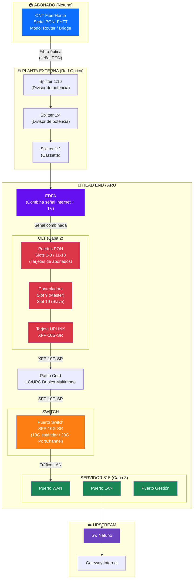
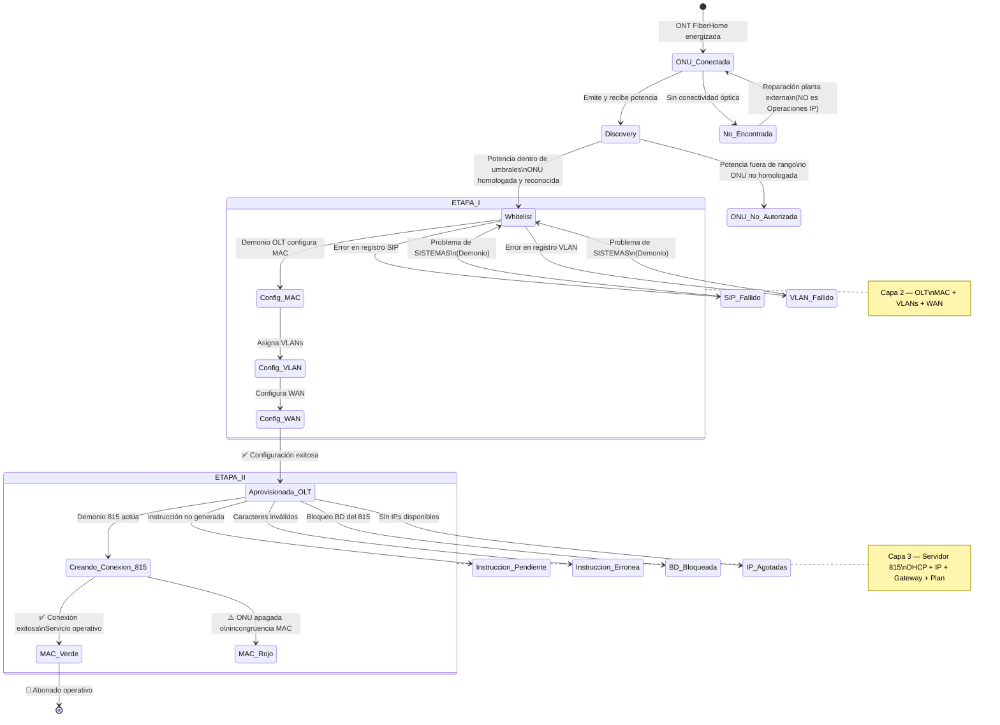
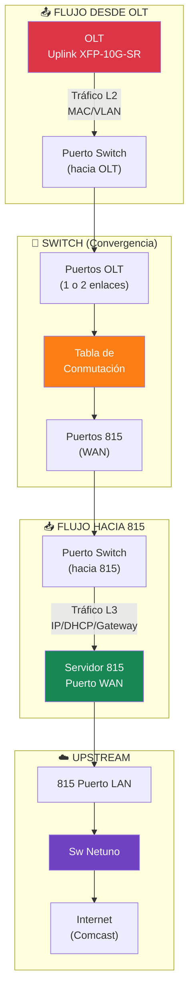

# Flujo de Datos FTTH — ONT FiberHome → Switch (OLT ∥ 815)

## 1. Flujo Físico de Datos (Capa Óptica → Capa de Red)

> [!NOTE]
> **Flujo FiberHome específico**: La red sigue el patrón **Netuno → Inter → Netuno** (a diferencia de Huawei que es Inter → Netuno → Inter). El abonado pertenece a **Netuno** y el serial PON es **FHTT**.

---

## 2. Flujo Lógico de Aprovisionamiento — Trabajo en Paralelo

El aprovisionamiento se ejecuta en **2 etapas secuenciales** mediante **demonios automatizados** (administrados por **SISTEMAS**, no por Operaciones IP). Sin embargo, dentro del headend, la configuración del OLT y el 815 operan como procesos que **convergen** sobre el Switch.

```mermaid
flowchart LR
    subgraph ETAPA_1["⚙️ ETAPA I — DEMONIO OLT (Capa 2)"]
        direction TB
        D_OLT["Demonio OLT\n(Automatizado - SISTEMAS)"]
        MAC["Configurar MAC"]
        VLAN["Asignar VLANs"]
        WAN_CFG["Configurar WAN"]
        D_OLT --> MAC --> VLAN --> WAN_CFG
    end

    subgraph CONVERGENCIA["🔀 SWITCH\n(Punto de Convergencia)"]
        direction TB
        SW["Switch de Distribución\n10G / 20G PortChannel"]
    end

    subgraph ETAPA_2["⚙️ ETAPA II — DEMONIO 815 (Capa 3)"]
        direction TB
        D_815["Demonio 815\n(Automatizado - SISTEMAS)"]
        DHCP["Configurar DHCP"]
        IP["Asignar IP"]
        WANMAC["Configurar WANMAC"]
        GW["Definir Gateway"]
        PLAN["Aplicar Plan\nde Navegación"]
        D_815 --> DHCP --> IP --> WANMAC --> GW --> PLAN
    end

    WAN_CFG -->|"Tráfico L2\n(OLT → SW)"| SW
    SW -->|"Tráfico L3\n(SW → 815)"| D_815

    style D_OLT fill:#dc3545,color:#fff
    style D_815 fill:#198754,color:#fff
    style SW fill:#fd7e14,color:#fff
    style MAC fill:#f8d7da,color:#842029
    style VLAN fill:#f8d7da,color:#842029
    style WAN_CFG fill:#f8d7da,color:#842029
    style DHCP fill:#d1e7dd,color:#0f5132
    style IP fill:#d1e7dd,color:#0f5132
    style WANMAC fill:#d1e7dd,color:#0f5132
    style GW fill:#d1e7dd,color:#0f5132
    style PLAN fill:#d1e7dd,color:#0f5132
```

> [!IMPORTANT]
> El **Demonio 815 solo actúa DESPUÉS** de que la ONU alcanza el estado "Aprovisionada en OLT". No son procesos verdaderamente paralelos, sino **secuenciales con convergencia en el Switch**.

---

## 3. Diagrama de Estados de la ONU FiberHome

---

## 4. Trabajo en "Paralelo" — Vista de Convergencia en el Switch

El Switch es el **punto de convergencia** donde ambos flujos (OLT y 815) se encuentran. Desde la perspectiva del Switch, gestiona **simultáneamente** el tráfico de ambos equipos:

### Capacidades de Enlace Switch ↔ OLT / 815

| Conexión | Estándar | PortChannel | Módulo |
|----------|:---:|:---:|------|
| **OLT → Switch** | 10 Gbps | 20 Gbps (2 enlaces) | XFP-10G-SR (OLT) + SFP-10G-SR (Switch) |
| **Switch → 815** | 10 Gbps | 20 Gbps (2 enlaces) | SFP-10G-SR ambos lados |

---

## 5. Matriz de Responsabilidades

| Componente | Responsable | Alcance |
|------------|------------|---------|
| **ONT FiberHome** (potencia óptica) | Planta Externa / ARU | Problemas de potencia, conexión física |
| **Demonio OLT** (aprovisionamiento L2) | SISTEMAS | Automatización, estados intermedios |
| **Demonio 815** (aprovisionamiento L3) | SISTEMAS | Creación conexiones, IPs, planes |
| **Switch** (conectividad) | Operaciones IP | Puertos, PortChannel, módulos |
| **Pruebas de velocidad** | Operaciones IP / ARU | CLI, contra Speedtest Inter, puerto GE de ONU |
| **Soporte FibraHogar** | Soporte | Verificar ONU encendida, estados |

---

## 6. Reglas Operacionales Críticas — FiberHome

> [!CAUTION]
> **Prohibiciones para ONUs FiberHome en modo BRIDGE:**
> - ❌ NO reaprovisionar por Soporte FibraHogar
> - ❌ NO enviar REFRESH por Soporte FibraHogar
> - ❌ NO eliminar en Gx si es IP certificada
> - ✅ SÍ se pueden eliminar/registrar en Gx si son **Empresa B**

| Modo ONU | Uso | Restricciones |
|----------|-----|---------------|
| **Router** | Abonado residencial estándar | Sin restricciones especiales |
| **Bridge** | IP certificada / Empresa B (Huawei) | Ver prohibiciones arriba |
| **Bridge** (FH nuevas) | Último firmware | Ahora soportado en ONUs sencillas |
