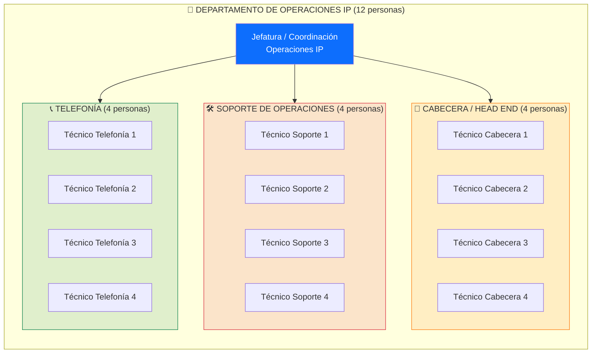
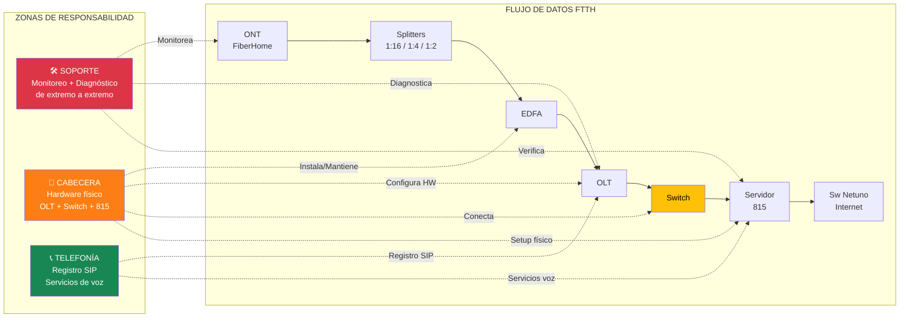
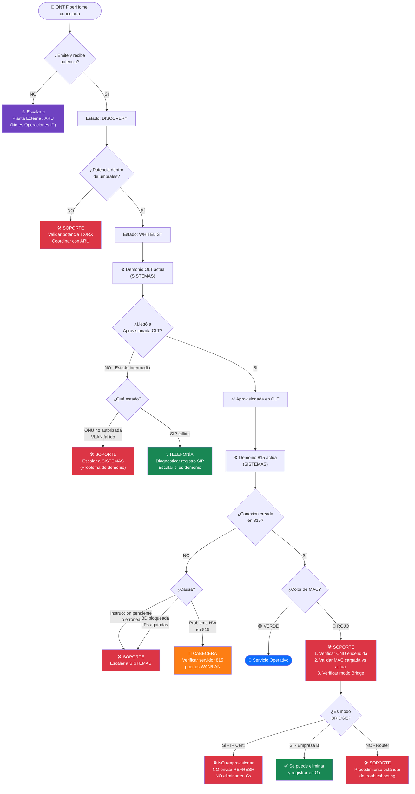
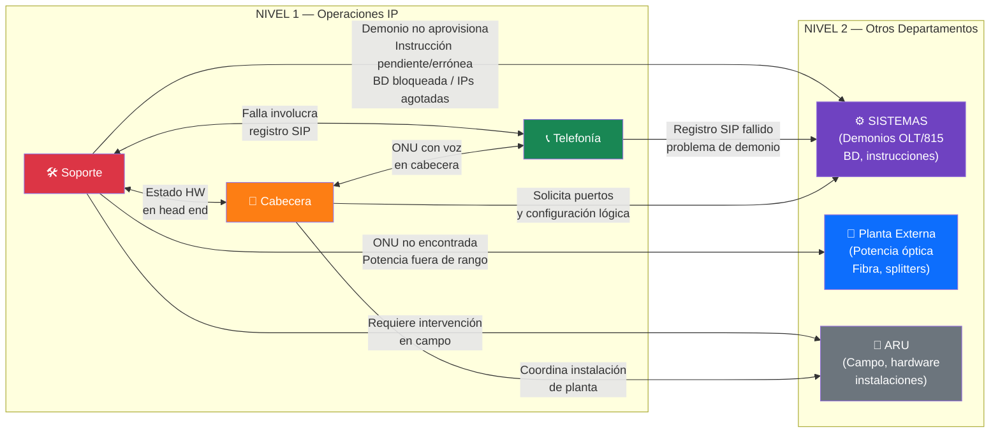
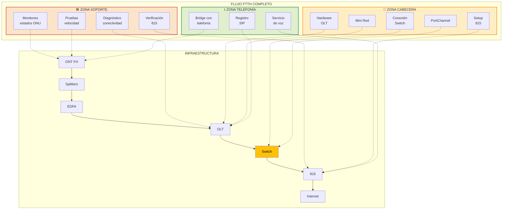

# Gestión del Flujo FTTH — Departamento de Operaciones IP

## 1. Estructura Organizacional

---

## 2. Alcance de Cada Área dentro del Flujo FTTH

---

## 3. Responsabilidades Detalladas por Área

### 🛠️ Área de Soporte de Operaciones (4 personas)

**Rol principal**: Monitoreo, diagnóstico y resolución de incidencias en la red FTTH desde la capa lógica.

| Función | Detalle |
|---------|---------|
| **Monitoreo de estados ONU** | Verificar Discovery, Whitelist, Aprovisionada, MAC Verde/Roja |
| **Diagnóstico de conectividad** | Identificar si la ONU está en "No encontrada", estados intermedios |
| **Verificación en Servidor 815** | Confirmar que la conexión se creó, IP asignada, WANMAC correcto |
| **Pruebas de velocidad** | Ejecutar por CLI contra Speedtest INTER, aislando la red del abonado |
| **Verificación de potencia** | Validar valores TX/RX de la ONU (dentro de umbrales) |
| **Soporte FibraHogar** | Consultar estado de ONU, verificar si está encendida |
| **Escalamiento** | Escalar a SISTEMAS si el demonio falla, a Planta Externa si hay problema óptico |
| **Coordinación con ARU** | Guiar al técnico de campo en procedimientos de troubleshooting |

> [!IMPORTANT]
> **Lo que Soporte NO hace:**
> - No administra los demonios de aprovisionamiento (es SISTEMAS)
> - No resuelve problemas de potencia óptica (es Planta Externa/ARU)
> - No reaprovisionan ni envían REFRESH a ONUs en modo BRIDGE

---

### 📡 Área de Cabecera / Head End (4 personas)

**Rol principal**: Instalación, configuración física y mantenimiento del hardware en el Head End.

| Función | Detalle |
|---------|---------|
| **Instalación de OLT** | Rack, energía, tarjetas de abonados (slots 1-8, 11-18), controladora (9-10) |
| **Conexión OLT ↔ Switch** | Instalar módulos XFP-10G-SR (OLT) y SFP-10G-SR (Switch), patch cords |
| **PortChannel OLT** | Ampliar capacidad de 10G a 20G conectando segundo enlace |
| **Setup Servidor 815** | Instalación física, conexión puertos WAN/LAN/Gestión |
| **PortChannel 815** | Ampliar capacidad WAN de 10G a 20G |
| **EDFA** | Instalación y mantenimiento del combinador de señal Internet + TV |
| **Mini Red** | Armar red de pruebas (splitters + ONU de prueba) para validar nuevas OLT |
| **Consola** | Acceso por cable consola USB a tarjeta HSWA de la OLT |
| **Coordinación con Soporte** | Indicar puertos disponibles, estado físico de equipos |

#### Hardware que gestiona Cabecera

| Equipo | Módulo/Componente | Conexión |
|--------|-------------------|----------|
| OLT → Switch | XFP-10G-SR + SFP-10G-SR | Patch cord LC/UPC Duplex Multimodo |
| 815 → Switch | SFP-10G-SR + SFP-10G-SR | Patch cord LC/UPC Duplex Multimodo |
| OLT Consola | Cable USB | A laptop con AnyDesk |
| Mini Red | Splitters + ONU prueba | Validación de nueva OLT |

---

### 📞 Área de Telefonía (4 personas)

**Rol principal**: Gestión de servicios de voz sobre la infraestructura FTTH (VoIP/SIP).

| Función | Detalle |
|---------|---------|
| **Registro SIP** | Gestión del registro SIP en las ONUs con servicio de voz |
| **Diagnóstico SIP fallido** | Identificar fallas de registro SIP (estado intermedio en OLT) |
| **ONUs con telefonía** | Configuración y soporte de ONUs FiberHome con servicio de voz |
| **Modo Bridge telefonía** | Soporte para ONUs FiberHome con telefonía en modo Bridge |
| **Coordinación con SISTEMAS** | Escalar problemas de registro SIP al equipo de demonios |
| **Calidad de voz** | Monitoreo y pruebas de calidad del servicio telefónico |

---

## 4. Flujo Operacional con Puntos de Intervención

---

## 5. Matriz RACI por Área

> **R** = Responsable | **A** = Aprueba | **C** = Consultado | **I** = Informado

| Actividad | Soporte (4) | Cabecera (4) | Telefonía (4) | SISTEMAS | Planta Ext. |
|-----------|:---:|:---:|:---:|:---:|:---:|
| Monitoreo de estado ONU | **R** | I | I | C | — |
| Diagnóstico de conectividad | **R** | C | — | C | C |
| Pruebas de velocidad (CLI) | **R** | C | — | — | — |
| Validación de potencia TX/RX | **R** | C | — | — | C |
| Verificación conexión en 815 | **R** | C | — | C | — |
| Instalación física OLT | I | **R** | — | C | — |
| Conexión OLT ↔ Switch | I | **R** | — | C | — |
| PortChannel (OLT o 815) | C | **R** | — | I | — |
| Setup físico Servidor 815 | I | **R** | — | C | — |
| Mantenimiento EDFA | I | **R** | — | — | — |
| Armar Mini Red de prueba | C | **R** | — | — | — |
| Registro SIP | C | — | **R** | C | — |
| Diagnóstico SIP fallido | C | — | **R** | C | — |
| ONUs con voz/telefonía | I | — | **R** | C | — |
| Modo Bridge (telefonía FH) | C | — | **R** | C | — |
| Escalamiento a SISTEMAS | **R** | C | **R** | **A** | — |
| Problemas de potencia óptica | C | — | — | — | **R** |

---

## 6. Protocolos de Escalamiento

### Criterios de Escalamiento

| Desde | Hacia | Cuándo escalar |
|-------|-------|----------------|
| **Soporte** → SISTEMAS | ONU en estado intermedio (Discovery, no autorizada, VLAN/SIP fallido), instrucción pendiente/errónea en 815, BD bloqueada, IPs agotadas |
| **Soporte** → Planta Ext. | ONU no encontrada, potencia fuera de umbrales, problemas de fibra |
| **Soporte** → Cabecera | Sospecha de falla en hardware (OLT, Switch, 815), puerto dañado |
| **Soporte** → Telefonía | Incidencia involucra registro SIP o servicio de voz |
| **Telefonía** → SISTEMAS | Registro SIP fallido por problema de demonio |
| **Cabecera** → SISTEMAS | Requiere configuración lógica post-instalación HW |
| **Cabecera** → ARU | Instalación en campo, mini red, módulos |

---

## 7. Resumen Visual — Las 3 Áreas en el Flujo

> [!TIP]
> **Distribución de carga sugerida**: Con 4 personas por área, se recomienda esquema de turnos rotativo para garantizar cobertura continua, donde al menos 2 personas estén activas por turno en cada área, permitiendo atender incidencias simultáneas sin dejar descubierta la operación.
