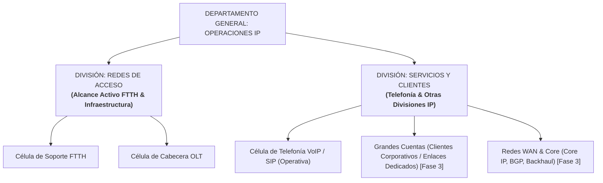

# Roadmap, Control de Módulos y Registro de Cambios
## Plataforma de Gestión Operacional y Métricas DERS — Operaciones IP (Inter FTTH)

Este documento es la bitácora oficial del proyecto. Sirve como guía para seguir el estado de cada componente, las decisiones técnicas tomadas, los módulos aprobados y los pasos a seguir sin perder el rumbo del desarrollo.

---

## 1. Estructura y Jerarquía Organizacional del Proyecto

El sistema organiza las áreas técnicas en dos divisiones principales, reflejando la realidad operativa y permitiendo supervisión agregada o granular:

> **Nota sobre dotación de personal:** El número de personas por célula y área es **100% variable y dinámico**. La plataforma calcula todas las métricas, promedios y balance de saturación en tiempo real a partir del número de colaboradores activos registrados en base de datos, sin restricciones fijas.

---

## 2. Matriz de Módulos del Sistema

| # | Módulo / Componente | Fase | Estado Actual | Archivos Principales |
| :-: | :--- | :-: | :-: | :--- |
| **M1** | **Motor de Métricas y Puntos DERS** | Fase 1 | **APROBADO** | `app/database.py`, `app/seed.py`, `app/main.py` |
| **M2** | **Workspace FSM y Cronometraje Automático** | Fase 1 | **APROBADO** | `app/templates/dashboard.html`, `app/static/js/dashboard.js` |
| **M3** | **Algoritmo de Extracción Telco (`TelcoEmailParser`)** | Fase 1 | **APROBADO** | `app/services/email_parser.py` |
| **M4** | **Reportes Gerenciales y Auditoría Forense (Excel)** | Fase 1 | **APROBADO** | `app/services/reports.py`, `app/templates/dashboard.html` |
| **M5** | **Asistente Inteligente de Comandos CLI (OLT / 815 / SW)** | Fase 2 | **PAUSADO / EN REGISTRO DE COMANDOS** | `app/services/command_generator.py` *(Estructura lista)* |
| **M6** | **Worker de Ingesta de Correo (IMAP / Background Worker)** | Fase 2 | **APROBADO** | `app/services/mail_worker.py`, `app/templates/dashboard.html`, `app/static/js/dashboard.js` |
| **M7** | **Portal de Autenticación, Roles RBAC y Sesiones** | Fase 2 | **APROBADO** | `app/templates/login.html`, `app/main.py`, `app/seed.py` |
| **M8** | **Sidebar Dinámico Plegable y Bandeja Microsoft 365** | Fase 2 | **APROBADO** | `app/templates/dashboard.html`, `app/static/js/dashboard.js` |
| **M9** | **Expansión: Grandes Cuentas y Operaciones WAN** | Fase 3 | **PLANIFICADO** | Arquitectura modular extensible |

---

## 3. Detalle de Módulos Implementados (Aprobados)

### Módulo 1: Motor de Métricas y Catálogo DERS
- **Propósito:** Medir la carga real de trabajo de los colaboradores distribuidos por células funcionales bajo el estándar de ponderación DERS.
- **Sistema de Puntos Ponderados:**
  - **P1 (1 pt):** Verificación de estado de ONT en OLT / Consultas simples.
  - **P2 (2 pts):** Resolución de discrepancia MAC / Pruebas de velocidad.
  - **P3 (3 pts):** Desatasco de demonio OLT (VLAN / Whitelist) / Sustitución SFP.
  - **P4 (5 pts):** Soporte a Modo Bridge con IP Certificada / Diagnóstico Jitter & MOS VoIP.
  - **P5 (8 pts):** Habilitación PortChannel 10G -> 20G / Contingencias troncales.
- **Velocímetro de Balance:** Categorización dinámica de saturación promedio por especialista activo (<=25 pts: *Equilibrada*, 26-45 pts: *Moderada*, >45 pts: *Alta / Alerta*).

### Módulo 2: Workspace de Atención y Cronometraje Automatizado
- **Propósito:** Brindar al técnico un espacio de trabajo único por ticket y eliminar al 100% el ingreso manual de tiempos.
- **Flujo FSM:**
  - `PENDIENTE` -> `EN PROGRESO` (al pulsar *Atender*, se bloquea con avatar/nombre del técnico para evitar trabajo duplicado y se inicia cronómetro en backend con `claimed_at = now()`).
  - `EN PROGRESO` -> `EN ESPERA` (botón de pausa cuando se espera respuesta de cuadrilla en terreno o verificación física de acometida; el tiempo pausado no penaliza el MTTR).
  - `EN PROGRESO` -> `COMPLETADO` (al pulsar *Resolver*, el sistema calcula de forma 100% automática `(now - claimed_at) - tiempo_pausado`, acredita los puntos y actualiza el dashboard).

### Módulo 3: Algoritmo de Extracción Telco (`TelcoEmailParser`)
- **Propósito:** Extraer entidades técnicas clave desde correos desestructurados en texto libre enviados por cuadrillas o NOC.
- **Sintaxis Oficial de Inter Integrada:**
  - **Abonado (10 dígitos exactos):** Soporta etiquetas `AB`, `AB:`, `Abonado:`, `Contrato:`, y extrae los 2 primeros dígitos como identificador de **Permisor** (ej. `P-10`, `P-25`).
  - **Serial PON (12 caracteres):** Reconocimiento de prefijos de red:
    - `FHTTXXXXXXXX` -> FiberHome (Red Inter)
    - `HWTCXXXXXXXX` -> Huawei (Red Netuno)
    - `STVXXXXXXXXX` / Otros -> SimpleTV / Terceros
  - **Nombre Canónico de OLT:** Normaliza variantes como `OLT CHAC 01` o `OLT VAL 02` a `OLT-CHAC-01` o `OLT-VAL-02`.
  - **Ubicación en OLT:** Asigna inteligentemente *"Consultar en OLT vía Serial PON"*.
  - **Detección Heurística de Modo Bridge / IP Certificada:** Si detecta términos de bridge o IP fija, enciende de forma obligatoria la **alerta en rojo de prohibición de refresh o reaprovisionamiento**.
- **Probador Interactivo en UI:** Botón *Analizar Caso Real* en el header para pegar texto libre y observar la distribución instantánea en casillas.

### Módulo 4: Reportes Gerenciales y Auditoría Forense (Excel)
- **Propósito:** Facilitar la toma de decisiones gerenciales, balance de turnos y trazabilidad forense ticket por ticket.
- **Panel Web Interactivo:** Filtros por período (*Hoy, Últimos 7d, Mes Actual, Todo*) y célula/división (*Todas las Áreas, Redes de Acceso, Soporte FTTH, Cabecera OLT, Telefonía VoIP*).
- **Exportación en 1 Clic a Excel (`.xlsx`):** Genera mediante `openpyxl` un libro con 3 hojas profesionales:
  1. *Resumen Ejecutivo y Células:* KPIs consolidados, horas de trabajo, % de participación de cada célula y semáforo de saturación.
  2. *Productividad Especialistas:* Detalle de todos los analistas activos con volumen de tickets, puntos totales, MTTR y desglose de tareas P1 a P5.
  3. *Log Detallado de Auditoría:* Trazabilidad completa con fechas, tiempos netos y pausas, datos de red (Abonado, Permisor, Serial, OLT, MAC) y notas de diagnóstico del operador.

### Módulo 6: Worker de Ingesta Real de Correos en Segundo Plano
- **Propósito:** Automatización completa de la ingesta de casos hacia la bandeja de correos FSM sin intervención humana.
- **Doble Modalidad de Operación:**
  1. **Modo Simulador de Laboratorio:** Genera casos sintéticos de soporte FTTH, cabecera OLT y telefonía VoIP respetando 100% los estándares de seriales FiberHome/Huawei, contratos de 10 dígitos y OLTs canónicas. Permite probar el sistema localmente sin conexión a internet ni requerir credenciales externas.
  2. **Modo IMAP SSL Real:** Conexión segura al servidor IMAP (`imaplib` con SSL por puerto 993), lectura de mensajes no leídos (`UNREAD`), extracción de cuerpo de texto plano / HTML multipart, marcado `\Seen` y extracción determinista con `TelcoEmailParser`.
- **Mecanismo Antiduplicidad:** Registro de `Message-ID` (RFC 2822) con índice único en SQLite (`idx_email_tickets_msgid`), garantizando idempotencia absoluta.
- **Control y Telemetría en Frontend:** Barra de telemetría (modo, estado activo/pausado, última sincronización e ingestados acumulados), botones de sincronización forzada y modal de configuración.

### Módulo 7: Portal de Autenticación, Roles RBAC y Sesiones
- **Propósito:** Control estricto de acceso corporativo para ingenieros de operaciones y gestión de sesiones persistentes.
- **Diseño Visual de Alto Impacto (`login-operaciones-ip-combinado`):**
  - Hero visual con datacenter de Inter, telemetría `NOC CENTRAL ONLINE`, imagotipo oficial y métricas de infraestructura crítica (`1,420+` Nodos Activos, `400 Gbps` Backbone, Criptografía `TLS 1.3 / AES-256`).
  - Panel de login en blanco puro con imagotipo oficial en azul corporativo, campos de usuario y contraseña con conmutador de visibilidad, casilla de recordar sesión y sello de auditoría.
- **Endpoints de Autenticación:**
  - `POST /api/auth/login`: Autenticación y emisión de cookie HTTP-Only `auth_user_id`.
  - `POST /api/auth/logout`: Invalidación de cookie y cierre de sesión seguro.
  - `GET /api/auth/me`: Consulta del perfil y permisos del usuario activo.
- **Cuenta de Administrador General:**
  - Correo: `admin@inter.com.ve` / Contraseña: `admin`.
  - Acceso total a todas las divisiones y células operativas para auditoría integral.

### Módulo 8: Sidebar Dinámico Plegable y Bandeja Microsoft 365
- **Propósito:** Experiencia de usuario avanzada modelada en base a kits de interfaz de Figma y flujo de trabajo habitual de Outlook 365.
- **Sidebar Jerárquico Animado:**
  - Acordeón interactivo con sub-divisiones por célula operativa (Redes FTTH, Cabecera OLT, Soporte, Telefonía, Grandes Cuentas).
  - Tarjeta de usuario en la esquina superior izquierda con iniciales, nombre y rol del ingeniero conectado.
- **Bandeja de Correo Dividida Estilo Outlook 365:**
  - Panel de carpetas de correo a la izquierda (Bandeja de entrada, Sin asignar, En proceso, Pausados, Resueltos).
  - Lista de mensajes con remitente, asunto, extracto técnico y etiqueta DERS (P1 a P5).
  - Panel de lectura integrado con chip de entidades técnicas extraídas y botón directo para atender ticket.

---

## 4. Próximos Pasos y Roadmap Futuro

- **Módulo 5: Asistente CLI (Fase 2):** Incorporación del motor de comandos específicos para OLT FiberHome / Huawei y switches de distribución.
- **Módulo 9: Grandes Cuentas y WAN Core (Fase 3):** Ampliación del catálogo DERS y panel de monitoreo para enlaces corporativos dedicados y transporte BGP.
- **Exportación en PDF:** Generación de reportes ejecutivos estructurados con membrete formal y logotipo oficial.
