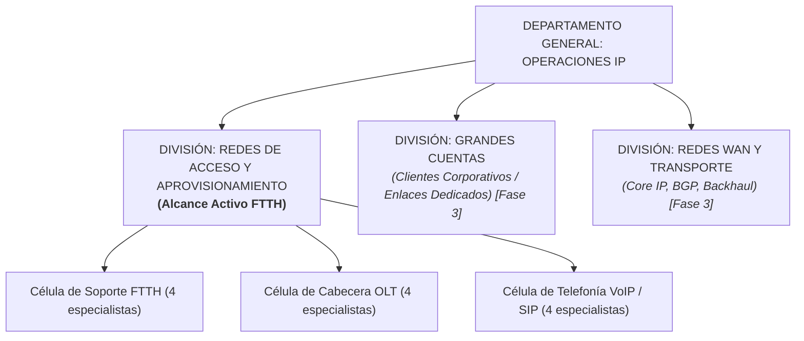

# Roadmap, Control de Módulos y Registro de Cambios
## Plataforma de Gestión Operacional y Métricas DERS — Operaciones IP (Inter FTTH)

Este documento es la bitácora oficial del proyecto. Sirve como guía para seguir el estado de cada componente, las decisiones técnicas tomadas, los módulos aprobados y los pasos a seguir sin perder el rumbo del desarrollo.

---

## 1. Estructura y Jerarquía Organizacional del Proyecto

---

## 2. Matriz de Módulos del Sistema

| # | Módulo / Componente | Fase | Estado Actual | Archivos Principales |
| :-: | :--- | :-: | :-: | :--- |
| **M1** | **Motor de Métricas y Puntos DERS** | Fase 1 | **APROBADO** | `app/database.py`, `app/seed.py`, `app/main.py` |
| **M2** | **Workspace FSM y Cronometraje Automático** | Fase 1 | **APROBADO** | `app/templates/dashboard.html`, `app/static/js/dashboard.js` |
| **M3** | **Algoritmo de Extracción Telco (`TelcoEmailParser`)** | Fase 1 | **APROBADO** | `app/services/email_parser.py` |
| **M4** | **Reportes Gerenciales y Auditoría Forense (Excel)** | Fase 1 | **APROBADO** | `app/services/reports.py`, `app/templates/dashboard.html` |
| **M5** | **Asistente Inteligente de Comandos CLI (OLT / 815 / SW)** | Fase 2 | **PAUSADO / EN REGISTRO DE COMANDOS** | `app/services/command_generator.py` *(Estructura lista)* |
| **M6** | **Worker de Ingesta de Correo (IMAP / Background Worker)** | Fase 2 | **APROBADO** | `app/services/mail_worker.py`, `app/templates/dashboard.html`, `app/static/js/dashboard.js` |
| **M7** | **Expansión: Grandes Cuentas y Operaciones WAN** | Fase 3 | **PLANIFICADO** | Arquitectura modular extensible |

---

## 3. Detalle de Módulos Implementados (Aprobados)

### Módulo 1: Motor de Métricas y Catálogo DERS
- **Propósito:** Medir la carga real de trabajo de los 12 analistas divididos equitativamente en 3 células funcionales (4 en Soporte, 4 en Cabecera y 4 en Telefonía).
- **Sistema de Puntos Ponderados:**
  - **P1 (1 pt):** Verificación de estado de ONT en OLT / Consultas simples.
  - **P2 (2 pts):** Resolución de discrepancia MAC / Pruebas de velocidad.
  - **P3 (3 pts):** Desatasco de demonio OLT (VLAN / Whitelist) / Sustitución SFP.
  - **P4 (5 pts):** Soporte a Modo Bridge con IP Certificada / Diagnóstico Jitter & MOS VoIP.
  - **P5 (8 pts):** Habilitación PortChannel 10G -> 20G / Contingencias troncales.
- **Velocímetro de Balance:** Categorización automática de saturación (<=25 pts: *Equilibrada*, 26-45 pts: *Moderada*, >45 pts: *Alta / Alerta*).

### Módulo 2: Workspace de Atención y Cronometraje Automatizado
- **Propósito:** Brindar al técnico un espacio de trabajo único por ticket y eliminar al 100% el ingreso manual de tiempos.
- **Flujo FSM:**
  - `PENDIENTE` -> `EN PROGRESO` (al pulsar *Atender*, se bloquea con avatar/nombre del técnico para evitar trabajo duplicado y se inicia cronómetro en backend con `claimed_at = now()`).
  - `EN PROGRESO` -> `EN ESPERA` (botón de pausa cuando se espera respuesta de cuadrilla en terreno o verificación física de acometida; el tiempo pausado no penaliza el MTTR).
  - `EN PROGRESO` -> `COMPLETADO` (al pulsar *Resolver*, el sistema calcula de forma 100% automática `(now - claimed_at) - tiempo_pausado`, acredita los puntos y actualiza el dashboard).

### Módulo 3: Algoritmo de Extracción Telco (`TelcoEmailParser`)
- **Propósito:** Extraer entidades técnicas clave desde correos desestructurados en texto libre enviados por cuadrillas o NOC.
- **Sintaxis Oficial de Inter Integrada:**
  - **Abonado (10 dígitos exactos):** Soporta etiquetas `AB`, `AB:`, `Abonado:`, `Contrato:`, y extrae los 2 primeros dígitos como identificador de **Permisor** (ej. `P-10`, `P-25`).
  - **Serial PON (12 caracteres):** Reconocimiento de prefijos de red:
    - `FHTTXXXXXXXX` -> FiberHome (Red Inter)
    - `HWTCXXXXXXXX` -> Huawei (Red Netuno)
    - `STVXXXXXXXXX` / Otros -> SimpleTV / Terceros
  - **Nombre Canónico de OLT:** Normaliza variantes como `OLT CHAC 01` o `OLT VAL 02` a `OLT-CHAC-01` o `OLT-VAL-02`.
  - **Ubicación en OLT:** Asigna inteligentemente *"Consultar en OLT vía Serial PON"*.
  - **Detección Heurística de Modo Bridge / IP Certificada:** Si detecta términos de bridge o IP fija, enciende de forma obligatoria la **alerta en rojo de prohibición de refresh o reaprovisionamiento**.
- **Probador Interactivo en UI:** Botón *Analizar Caso Real* en el header para pegar texto libre y observar la distribución instantánea en casillas.

### Módulo 4: Reportes Gerenciales y Auditoría Forense (Excel)
- **Propósito:** Facilitar la toma de decisiones gerenciales, balance de turnos y trazabilidad forense ticket por ticket.
- **Panel Web Interactivo:** Filtros por período (*Hoy, Últimos 7d, Mes Actual, Todo*) y célula (*Todas, Soporte, Cabecera, Telefonía*).
- **Exportación en 1 Clic a Excel (`.xlsx`):** Genera mediante `openpyxl` un libro con 3 hojas profesionales:
  1. *Resumen Ejecutivo y Células:* KPIs consolidados, horas de trabajo, % de participación de cada célula y semáforo de saturación.
  2. *Productividad Especialistas:* Detalle de los 12 analistas con volumen de tickets, puntos totales, MTTR y desglose de tareas P1 a P5.
  3. *Log Detallado de Auditoría:* Trazabilidad completa con fechas, tiempos netos y pausas, datos de red (Abonado, Permisor, Serial, OLT, MAC) y notas de diagnóstico del operador.

### Módulo 6: Worker de Ingesta Real de Correos en Segundo Plano
- **Propósito:** Automatización completa de la ingesta de casos hacia la bandeja de correos FSM sin intervención humana.
- **Doble Modalidad de Operación:**
  1. **Modo Simulador de Laboratorio:** Genera casos sintéticos de soporte FTTH, cabecera OLT y telefonía VoIP respetando 100% los estándares de seriales FiberHome/Huawei, contratos de 10 dígitos y OLTs canónicas. Permite probar el sistema localmente sin conexión a internet ni requerir credenciales externas.
  2. **Modo IMAP SSL Real:** Conexión segura al servidor IMAP (`imaplib` con SSL por puerto 993), lectura de mensajes no leídos (`UNREAD`), extracción de cuerpo de texto plano / HTML multipart, marcado `\Seen` y extracción determinista con `TelcoEmailParser`.
- **Mecanismo Antiduplicidad:** Registro de `Message-ID` (RFC 2822) con índice único en SQLite (`idx_email_tickets_msgid`), garantizando idempotencia absoluta.
- **Control y Telemetría en Frontend:**
  - Barra de estado sobria: Modo activo, estado de ejecución (Activo vs Pausado), última sincronización e ingestados acumulados.
  - Botón *Sincronizar Ahora* para forzar lectura inmediata.
  - Botón *Pausar / Reanudar* para control operativo del hilo.
  - Modal de configuración de parámetros del worker (modo, intervalo, servidor, puerto, credenciales).
  - Etiqueta de procedencia en cada ticket (`IMAP Real`, `Simulador`, `Manual`) tanto en la tabla como en el modal de atención técnica.

---

## 4. Módulo 5: Asistente Inteligente de Comandos CLI (Pausado para Registro)

Este módulo queda en espera de que el usuario consolide y registre la lista oficial de comandos operativos:

### Alcance a Implementar en Siguiente Sesión:
1. **Catálogo por Fabricante:**
   - **FiberHome (AN5516 / AN5116):** `show card`, `show pon power`, desatasco de demonio y consulta Whitelist.
   - **Huawei (MA5608T / MA5800):** `display ont info`, `display ont optical-info`.
   - **Servidor 815 (Gx):** Consulta de WANMAC y verificación de sesiones PPPoE/IPoE.
2. **Autocompletado Contextual:** Al abrir el ticket, los comandos se prellenan con el Slot, PON y Serial del caso.
3. **Barrera de Seguridad:** Bloqueo preventivo de comandos de reinicio o refresh si el ticket está marcado como Modo Bridge con IP Certificada.

---

## 5. Registro Cronológico de Versiones (Changelog)

- **v0.1 (2026-09-04):** Análisis de documentación base (`Capacitacion FTTH.pptx`, `EsquemaOLT_SW_815_FTTH_General v2.pptx`). Extracción de imágenes y esquemas de red.
- **v0.2 (2026-09-04):** Diseño del catálogo de tareas DERS (20 tipos), matriz Excel inicial y base de datos SQLite con los 12 especialistas.
- **v0.3 (2026-09-09):** Construcción del Dashboard frontend con diseño SnowUI, gráficos Chart.js (curvas spline y donas de complejidad) y navegación por células.
- **v0.4 (2026-09-09):** Creación del Workspace Modal de tickets con cronómetro en vivo (`HH:MM:SS`), botón de pausa por espera de terreno y cálculo de MTTR neto 100% automatizado.
- **v0.5 (2026-09-09):** Creación del servicio `TelcoEmailParser` con soporte a abonados de 10 dígitos, detección de Permisor, seriales de 12 caracteres (Inter / Netuno / SimpleTV), OLTs canónicas y botón interactivo *Analizar Caso Real*.
- **v0.6 (2026-09-09):** Reestructuración jerárquica departamental en Frontend (*Operaciones IP -> Acceso & Aprov. -> Células FTTH*) y desarrollo del Módulo de Reportes Gerenciales con exportación a Excel en 3 hojas (`openpyxl`).
- **v0.7 (2026-09-09):** Inicialización del repositorio Git, sanitización de credenciales, configuración de `.gitignore`, `README.md` y publicación en GitHub: `joseacorobo/PrototipoWeb_OperacionesIP`.
- **v0.8 (2026-09-09):** Creación del documento oficial de Roadmap y Control de Módulos (`ROADMAP_Y_CONTROL_MODULOS.md`).
- **v0.9 (2026-09-09):** Definición arquitectónica del Módulo 6 (Worker de Correo Multi-Buzón) y pausa programada para registro de comandos CLI del Módulo 5.
- **v1.0 (2026-09-09):** Implementación integral del Módulo 6: `MailWorker` autónomo con modos Simulador e IMAP Real SSL, deduplicación `Message-ID`, endpoints de control, barra de telemetría y modal de configuración en frontend. Eliminación estricta de emojis decorativos en interfaz y bitácoras para estilo corporativo sobrio.

---

*Última actualización: 2026-09-09 15:40*\n